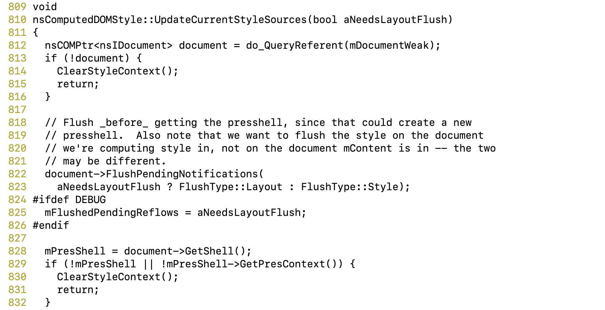

# CVE-2017-7828

A use-after-free vulnerability can occur when flushing and resizing layout because the "PressShell" object has been freed while still in use. This results in a potentially exploitable crash during these operations. This vulnerability affects Firefox < 57, Firefox ESR < 52.5, and Thunderbird < 52.5.

## Firefox

I tested this vulnerability with Firefox 56.0 ASAN build downloaded from [here](https://ftp.mozilla.org/pub/firefox/releases/56.0/source/). The mozconfig I used is [here](https://github.com/ZihanYe/Firefox-Exploitation/blob/master/Manual%20Exploitation/CVE-2017-7828/mozconfig).

To build it, I had to downgrade my rust to 1.19.0 according to [Firefox's Rust Update policy](https://wiki.mozilla.org/Rust_Update_Policy_for_Firefox).

In order for making Firefox opening the PoC file without any other disruption, I used some customized preferences. Preferences can be set in ```about:config``` page in Firefox by searching for preferences listed in [user.js](https://github.com/ZihanYe/Firefox-Exploitation/blob/master/Manual%20Exploitation/CVE-2017-7828/user.js), or if you are running Firefox in headless mode (```--headless```), then create a new profile like this:

```
mkdir -p /path/to/firefox/build/directory/tmp/customized_profile
```
and move [user.js]() under the new profile folder.

Run firefox with options ```--headless --no-remote --profile /path/to/the/profile/folder/just/created file:///path/to/crash.html```

## PoC

It involves free of an ```PresShell``` object leading to a dangling pointer within an ```nsComputedDOMStyle``` object and ```nsIFrame``` object.


Inside ```start``` function, an HTMLIFrameElement ```o243``` is added with source inside ```script.html```. It executes an XBL script which calls ```fun2```. In Line 28, ```fun3``` is registered as the callback function when content window resizes.

Afterwards, during loading of the window, ```GetPropertyCSSValue``` gets executed and everything happens within that context.

## Where mPresShell is freed

At some point ```nsComputedDOMStyle::GetPropertyCSSValue``` in ```nsComputedDOMStyle.cpp``` is executed:


**Figure 1: GetPropertyCSSValue**

In Line 1028, it calls ```nsComputedDOMStyle::UpdateCurrentStyleSources```:



In Line 828 inside ```UpdateCurrentStyleSources```, ```mPresShell``` of this ```nsComputedDOMStyle``` object is set to ```document->GetShell()```. Then in the same function, it calls ```nsComputedDOMStyle::GetStyleContext``` which result in the following stack trace:


```FireResizeEvent``` is called, which triggers the callback function (```fun3```) registered in PoC. Within the callback function, the ```PressShell``` object is freed.


Upon returning to the original context of the ```nsComputedDOMStyle``` object, it does not know ```mPresShell``` has been freed.

## Where the dangling pointer is dereferenced

The PoC then returns to ```nsComputedDOMStyle::GetPropertyCSSValue``` (see Figure 1), in Line 1039, 

```val = (this->*getter)();```, where the getter points to ```DoGetWidth()```:


Within ```nsComputedDOMStyle::DoGetWidth```, it calls ```mInnerFrame->GetContentRect()```

```mInnerFrame``` is an instance of ```mozilla::nsIFrame```. It can access a ```PresContext``` object which contains freed ```PresShell``` object. Then within its method, it uses the ```PresShell``` object, which causes ASAN to report.

The PoC then crashes with the following stack trace:

```
 #0 0x7f43f69ce18c in nsIFrame::GetUsedBorderAndPadding() const /home/ug16zy2/firefox-56.0/layout/generic/nsIFrame.h:1301:12
    #1 0x7f43f69ce18c in nsIFrame::GetContentRectRelativeToSelf() const /home/ug16zy2/firefox-56.0/layout/generic/nsFrame.cpp:1434
    #2 0x7f43f69ce18c in nsIFrame::GetContentRect() const /home/ug16zy2/firefox-56.0/layout/generic/nsFrame.cpp:1444
    #3 0x7f43f64e612d in nsComputedDOMStyle::DoGetWidth() /home/ug16zy2/firefox-56.0/layout/style/nsComputedDOMStyle.cpp:5106:35
    #4 0x7f43f64b1a12 in nsComputedDOMStyle::GetPropertyCSSValue(nsAString const&, mozilla::ErrorResult&) /home/ug16zy2/firefox-56.0/layout/style/nsComputedDOMStyle.cpp:1039:11
```

## Exploitation
We can of cause exploit dereferences happening after the callback and before ```nsComputedDOMStyle::GetPropertyCSSValue``` returns but it is really limited. As the dangling pointer is ```mPresShell``` of an ```nsComputedDOMStyle``` object, I am not sure whether it can be used again under our control (with JS code) if we manage to avoid crashing before parser takes next line of JS code.


## Reference 

[Bug Report](https://bugzilla.mozilla.org/show_bug.cgi?id=1406750)