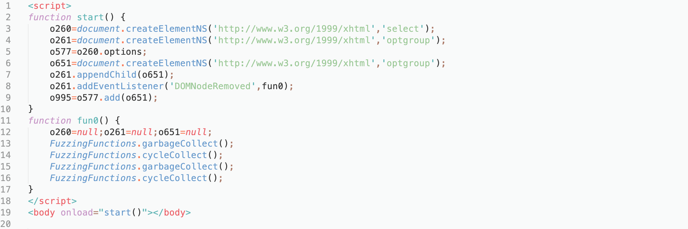
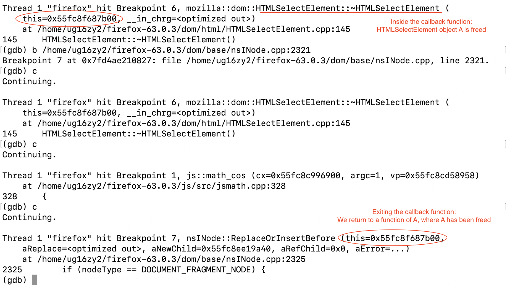

# CVE-2018-18492

A use-after-free vulnerability can occur after deleting a selection element due to a weak reference to the select element in the options collection. This results in a potentially exploitable crash. This vulnerability affects Thunderbird < 60.4, Firefox ESR < 60.4, and Firefox < 64.

## Firefox

I tested this vulnerability with Firefox 63.0.3 ASAN+Fuzzing build downloaded from [here](https://ftp.mozilla.org/pub/firefox/releases/63.0.3/source/). The mozconfig I used is [here](https://github.com/ZihanYe/Firefox-Exploitation/blob/master/Manual%20Exploitation/CVE-2018-18492/mozconfig).

In order for making Firefox opening the PoC file without any other disruption, I used some customized preferences. Preferences can be set in ```about:config``` page in Firefox by searching for preferences listed in [user.js](https://github.com/ZihanYe/Firefox-Exploitation/blob/master/Manual%20Exploitation/CVE-2018-18492/user.js), or if you are running Firefox in headless mode (```--headless```), then create a new profile like this:

```
mkdir -p /path/to/firefox/build/directory/tmp/customized_profile
```
and move [user.js]() under the new profile folder.

Run firefox with options ```--headless --no-remote --profile /path/to/the/profile/folder/just/created file:///path/to/crash.html```


## PoC



The vulnerability happens when ```o995=o577.add(o651);``` is executed. When adding o651 to o577, we want to remove ```o651``` from its old parent o261, which trigger the callback function registered with ```DOMNodeRemoved``` event. In the callback function, we set a couple of things to null and force garbage collection, when returning to the original context, there are dangling pointers.

## Where the free is triggered

In Line 3 and 5, an ```HTMLSelectElement``` object A and an ```HTMLOptionsCollection``` object B is created, corresponding to o260 and o577 respectively.

```o995=o577.add(o651);``` calls underlying C++ function ```HTMLOptionsCollection::Add```:


Its ```mSelect``` points to ```HTMLSelectElement``` object A (associated with o260). ```mSelect->Add``` is called. Within ```Add```, it calls ```AppendChild``` (Line 580) and results in the following stack trace:


Note that all these functions are functions of A itself. ```this``` is still pointing to object A. Inside function ```nsINode::ReplaceOrInsertBefore```, it check if the node about to be inserted has an parent already, if so, it firstly remove the node from Children list of its old parent. This is where a node is removed (Line 2320) and event 'DOMNodeRemoved' is triggered.


Then within the callback function, A (i.e o260 in Javascript) is freed. However we still return to the original context, that is, ```ReplaceOrInsertBefore``` of A. The screenshot below illustrates the vulnerability:



At this point, ```this``` is a dangling pointer. ASAN reports when it access other data inside the object afterwards.

```
READ of size 8 at 0x612000225068 thread T0
    #0 0x7f20456d1ad3 in nsINode::IsDocument() const /home/ug16zy2/firefox-63.0.3/dom/base/nsINode.h:418
    #1 0x7f20456d1ad3 in IsAllowedAsChild /home/ug16zy2/firefox-63.0.3/dom/base/nsINode.cpp:2120
    #2 0x7f20457f5898 in nsINode::EnsurePreInsertionValidity2(bool, nsINode&, nsINode*, mozilla::ErrorResult&) /home/ug16zy2/firefox-63.0.3/dom/base/nsINode.cpp:2269
    #3 0x7f20457f5898 in nsINode::ReplaceOrInsertBefore(bool, nsINode*, nsINode*, mozilla::ErrorResult&) /home/ug16zy2/firefox-63.0.3/dom/base/nsINode.cpp:2335
    #4 0x7f2048be24b9 in nsINode::InsertBefore(nsINode&, nsINode*, mozilla::ErrorResult&) /home/ug16zy2/firefox-63.0.3/dom/base/nsINode.h:1798
    #5 0x7f2048be24b9 in nsINode::AppendChild(nsINode&, mozilla::ErrorResult&) /home/ug16zy2/firefox-63.0.3/dom/base/nsINode.h:1802
    #6 0x7f2048be24b9 in mozilla::dom::HTMLSelectElement::Add(nsGenericHTMLElement&, nsGenericHTMLElement*, mozilla::ErrorResult&) /home/ug16zy2/firefox-63.0.3/dom/html/HTMLSelectElement.cpp:580
```

## Exploitation

As on Javascript level, o260 has been set to null, so there should be no way to access any pointer to the underlying ```HTMLSelectElement```. We can exploit dereferences happening after returning from the callback and before ```HTMLSelectElement::Add``` returns, as "this" pointer still points to the freed object.


## Reference:

[1] [Bug Report](https://bugzilla.mozilla.org/show_bug.cgi?id=1499861)


