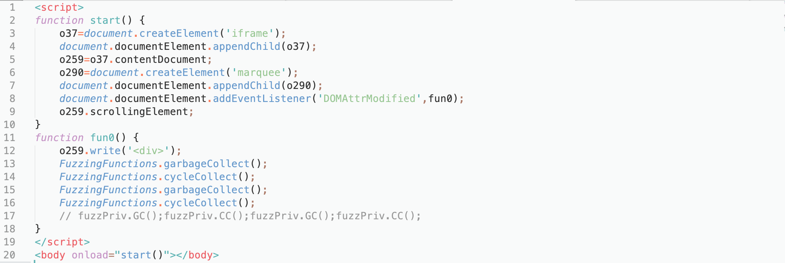
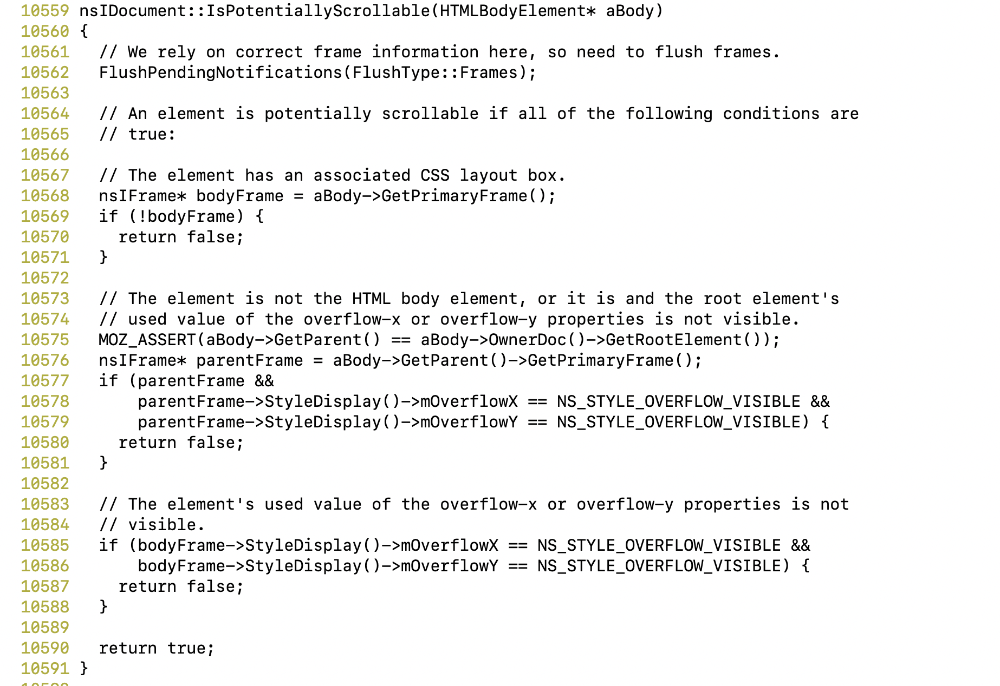

# CVE-2018-5100

## Description

A use-after-free vulnerability can occur when arguments passed to the "IsPotentiallyScrollable" function are freed while still in use by scripts. This results in a potentially exploitable crash. This vulnerability affects Firefox < 58.

## Firefox

I tested this vulnerability with Firefox 56.0 ASAN+Fuzzing build. The mozconfig I used is [here]().

In order for making Firefox opening the PoC file without any other disruption, I used some customized preferences. Preferences can be set in ```about:config``` page in Firefox by searching for preferences listed in [user.js](), or if you are running Firefox in headless mode (```--headless```), then create a new profile like this:

```
mkdir -p /path/to/firefox/build/directory/tmp/customized_profile
```
and move [user.js]() under the new profile folder.

Run firefox with options ```--headless --no-remote --profile /path/to/the/profile/folder/just/created file:///path/to/crash.html```


## PoC

The original crash test uses ```FuzzPriv``` extention. However I did not managed to install it. Alternatively, we can use ```FuzzingFunctions``` interface implemented in fuzzing build of Firefox. So instead of triggering GC/CC using the extension, I used 

```
FuzzingFunctions.garbageCollect();
FuzzingFunctions.cycleCollect();
```



The vulnerability is caused when inside a function ```IsPotentiallyScrollable```, an ```HTMLBodyElement``` is passed in but later freed because of the callback function being triggered.

## Where HTMLBodyElement is freed

In Line 9, getting scrollingElemnent leads to ```nsIDocument::GetScrollingElement()``` in :


It calls ```nsIDocument::IsPotentiallyScrollable```. The ```HTMLBodyElement``` passed in is the body element associated with ```o259``` in Javascript.

In ```nsIDocument::IsPotentiallyScrollable```:



```FlushPendingNotifications``` is called, in which the callback function ```fun0``` is triggered. In Line 12, writing to ```o259``` causes the old body element being overwritten. So the argument of ```FlushPendingNotifications``` is freed.

## Where the dangling pointer is dereferenced

When returning to ```FlushPendingNotifications``` after callback is executed. We get to Line 10568, which uses the dangling pointer (```aBody```)

ASAN reports a use-after-free with the following stack trace:

```
READ of size 4 at 0x60d00026a96c thread T0
    #0 0x7fdd5cbe34cc in nsINode::GetBoolFlag(nsINode::BooleanFlag) const /home/ug16zy2/firefox-56.0/dom/base/nsINode.h:1602:12
    #1 0x7fdd5cbe34cc in nsINode::IsInUncomposedDoc() const /home/ug16zy2/firefox-56.0/dom/base/nsINode.h:540
    #2 0x7fdd5cbe34cc in nsIContent::GetPrimaryFrame() const /home/ug16zy2/firefox-56.0/objdir-ff-asan/dist/include/nsIContent.h:911
    #3 0x7fdd5cbe34cc in mozilla::dom::Element::GetPrimaryFrame() const /home/ug16zy2/firefox-56.0/objdir-ff-asan/dist/include/mozilla/dom/Element.h:1196
    #4 0x7fdd5cbe34cc in nsIDocument::IsPotentiallyScrollable(mozilla::dom::HTMLBodyElement*) /home/ug16zy2/firefox-56.0/dom/base/nsDocument.cpp:10568
    #5 0x7fdd5cbe3873 in nsIDocument::GetScrollingElement() /home/ug16zy2/firefox-56.0/dom/base/nsDocument.cpp:10599:18
```

## Exploitation

If we look at how the dangling pointer could be derefenced after returning from ```FlushPendingNotification```, we can exploit the dangling pointer inside ```IsPotentiallyScrollable```. 

I presume that alternatively we can craft the new target object so that ```IsPotentiallyScrollable``` returns false and hence ```GetScrollingElement``` returns the dangling pointer, and we get the danling pointer in Javascript and continue with other dereferences.


