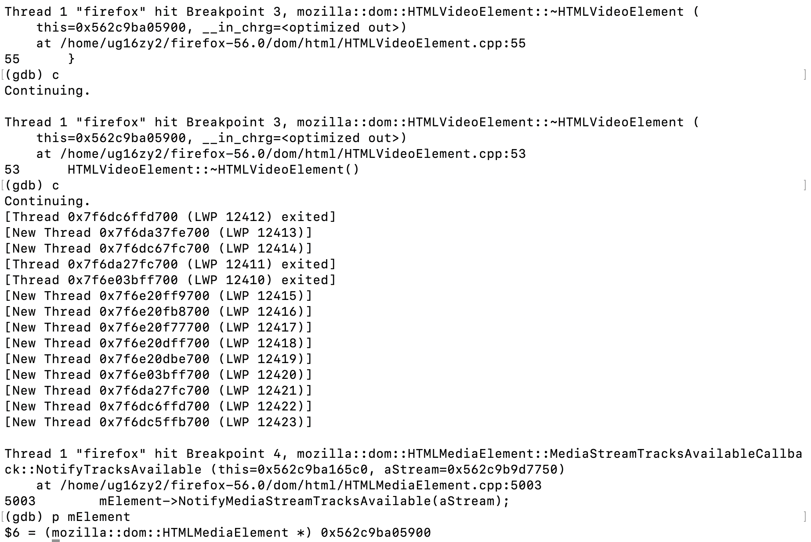

# CVE-2018-5102

## Description
heap-use-after-free in mozilla::dom::HTMLMediaElement::NotifyMediaStreamTracksAvailable

## Firefox

I ran it on both Firefox 56.0 and 57.0 build, ASAN reports use-after-free in both cases.
It needs "--enable-fuzzing" and the FuzzingFunctions interface.

## Poc



An ```HTMLVideoElement``` (a subclass of ```HTMLMediaElement```) is freed, but still referenced by ```DOMMediaStream```, which invokes ```CheckTracksAvailable()``` and hence the callback function associated with the freed object.
