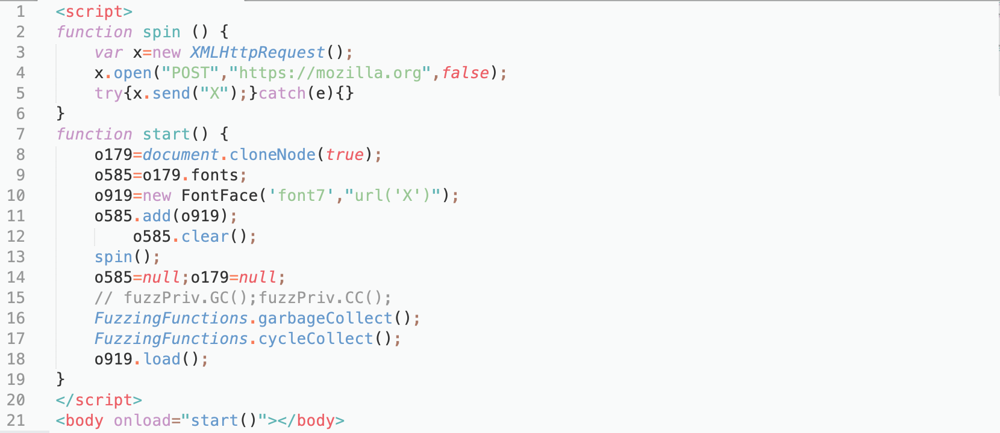
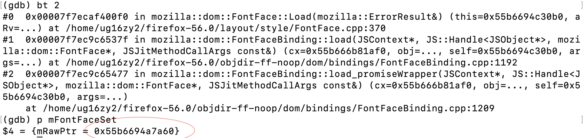

# CVE-2018-5104

## Description

heap-use-after-free in gfxUserFontEntry::DoLoadNextSrc

## Firefox

I tested this vulnerability with Firefox 56.0 ASAN+Fuzzing build.

## PoC

The original crash test uses ```FuzzPriv``` extention. However I did not managed to install it. Alternatively, we can use ```FuzzingFunctions``` interface implemented in fuzzing build of Firefox. So instead of triggering GC/CC using the extension, I used

```
FuzzingFunctions.garbageCollect();
FuzzingFunctions.cycleCollect();
```



The vulnerability is caused because a ```FontFaceSet``` is freed but a ```FontFace``` still keeps a reference to it.

## Where FontFaceSet is freed:

After setting ```o585``` and ```o179``` to null, garbage collection collects them.

In GDB:


## Where the dangling pointer is dereferenced

In ```FontFace``` object associated with o919, ```mFontFaceSet``` still points to the freed object. ```mozilla::dom::FontFace::Load``` triggers use it:


